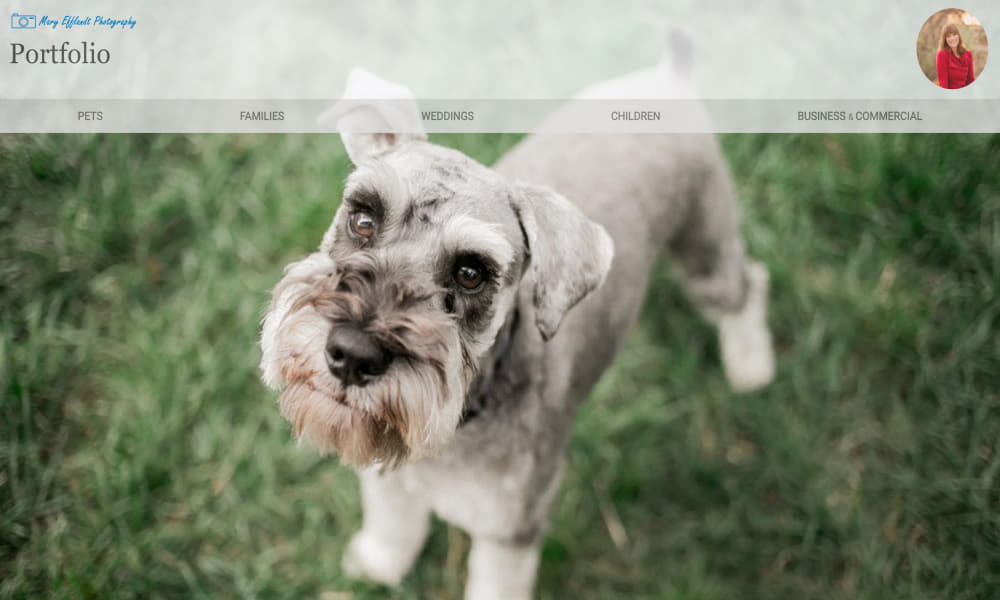

+++
title = "Portfolio Site"
image = "portfolio.jpg"
# header_image = "images/mep.jpg"
weight = "2"

code_url = "https://github.com/byron42/my-portfolio/blob/master/website/portfolio-site/themes/initio/layouts/index.html"
repo_url = "https://github.com/byron42/my-portfolio/tree/master/website/portfolio-site"

[[resources]]
 src = "portfolio.jpg"

+++
<!--  -->

